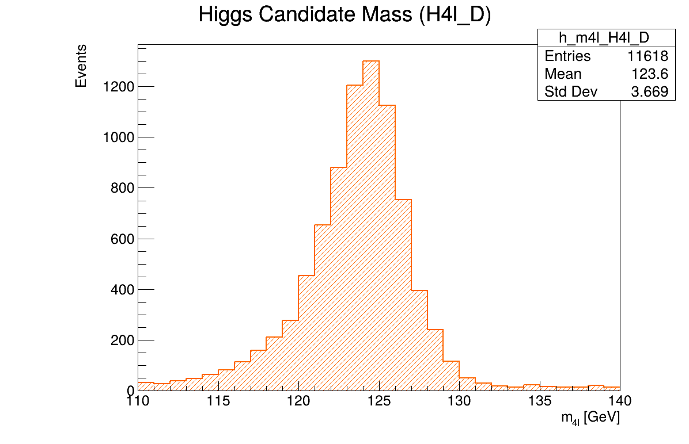
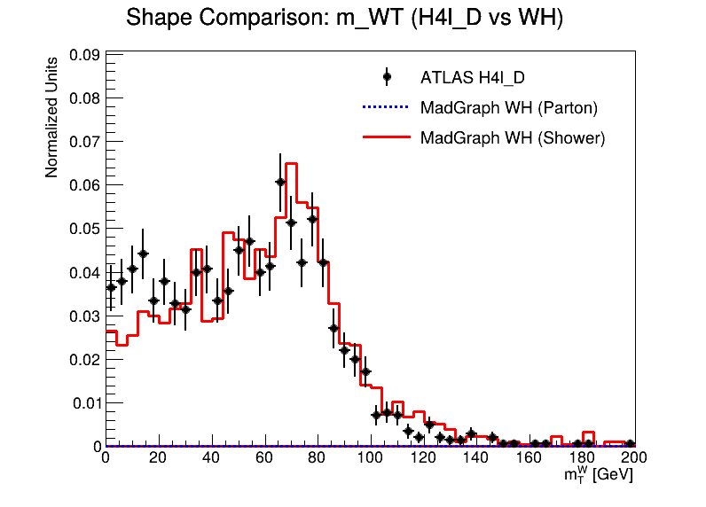

  <a href="#english-version-gb">🇬🇧 English</a> | <a href="#versione-italiana-it">🇮🇹 Italiano</a>

---

<h1 id="english-version-gb">🇬🇧 Identifying the Higgs Boson Production Mechanism at the LHC</h1>

**Author:** Nicolò Favagrossa (Università degli Studi di Milano)

## Overview
This repository contains a computational physics analysis aimed at identifying the production mechanisms of the Higgs boson at the Large Hadron Collider (LHC). The project is divided into two main parts:
1. **Theoretical Simulation:** Using `MadGraph5_aMC@NLO` to generate Monte Carlo samples for the main Higgs production topologies (ggF, VBF, WH, ZH) and study their kinematic signatures.
2. **Blind Sample Analysis:** Analyzing blind samples from ATLAS Open Data ($H \rightarrow ZZ^* \rightarrow 4\ell$ channel) to identify the most probable production mechanism for each sample (A, B, C, D) by comparing their kinematic distributions with our theoretical simulations.

## Key Results

### Higgs Mass Reconstruction
The four-lepton invariant mass ($m_{4\ell}$) allows for a clean reconstruction of the Higgs boson mass peak around 125 GeV.

  

### Production Mechanism Identification: Sample D & WH
By comparing the kinematic distributions of the blind samples with the theoretical simulations, we can perform shape matching. For instance, the transverse mass of the W boson ($m_{W,T}$) strongly suggests that **Sample D** is compatible with the **WH associated production** mechanism, showing an excellent overlap.

  

## Repository Structure
- `src/`: Python scripts for grid generation, Delphes/parton level analysis, and kinematic comparisons.
- `results/`: Output plots, shape matching comparisons, and reconstructed mass distributions.
- `docs/`: Project documentation and assignments.

---

<h1 id="versione-italiana-it">🇮🇹 Identificazione del Meccanismo di Produzione del Bosone di Higgs ad LHC</h1>

**Autore:** Nicolò Favagrossa (Università degli Studi di Milano)

## Panoramica
Questa repository contiene un'analisi di fisica computazionale mirata all'identificazione dei meccanismi di produzione del bosone di Higgs al Large Hadron Collider (LHC). Il progetto è diviso in due parti principali:
1. **Simulazione Teorica:** Utilizzo di `MadGraph5_aMC@NLO` per generare campioni Monte Carlo per le principali topologie di produzione dell'Higgs (ggF, VBF, WH, ZH) e studiarne le firme cinematiche.
2. **Analisi di Campioni Ciechi:** Analisi di campioni anonimizzati provenienti dagli ATLAS Open Data (canale $H \rightarrow ZZ^* \rightarrow 4\ell$) per identificare il meccanismo di produzione più probabile per ciascun campione (A, B, C, D) confrontando le distribuzioni cinematiche con le nostre simulazioni.

## Risultati Principali

### Ricostruzione della Massa dell'Higgs
La massa invariante a quattro leptoni ($m_{4\ell}$) permette una chiara ricostruzione del picco di massa del bosone di Higgs attorno a 125 GeV.

  

### Identificazione del Meccanismo: Campione D & WH
Confrontando le distribuzioni cinematiche dei campioni ciechi con le simulazioni teoriche, è possibile effettuare uno *shape matching*. Ad esempio, la massa trasversa del bosone W ($m_{W,T}$) suggerisce fortemente che il **Campione D** sia compatibile con il meccanismo di produzione associata **WH**, mostrando una sovrapposizione eccellente.

  

## Struttura della Repository
- `src/`: Script Python per la generazione delle griglie, analisi a livello Delphes/partonico e confronti cinematici.
- `results/`: Grafici di output, confronti di shape matching e distribuzioni di massa ricostruite.
- `docs/`: Documentazione del progetto e consegne.